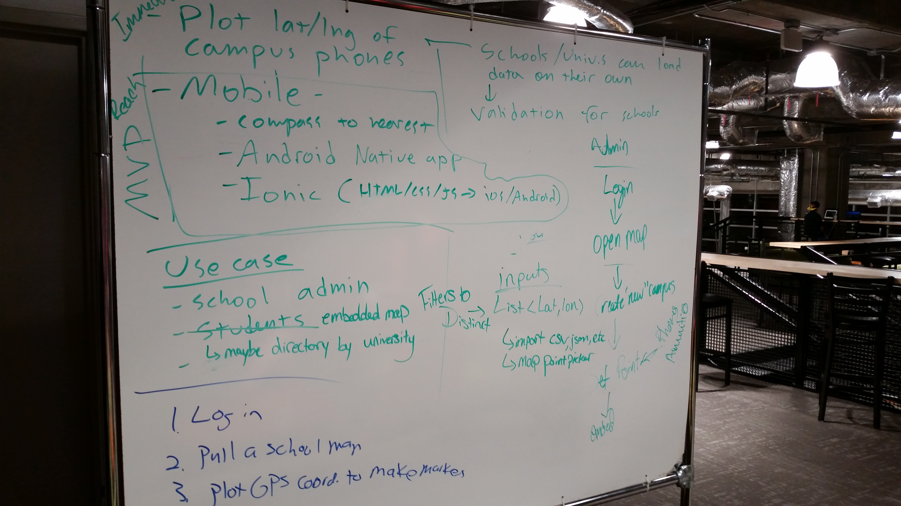
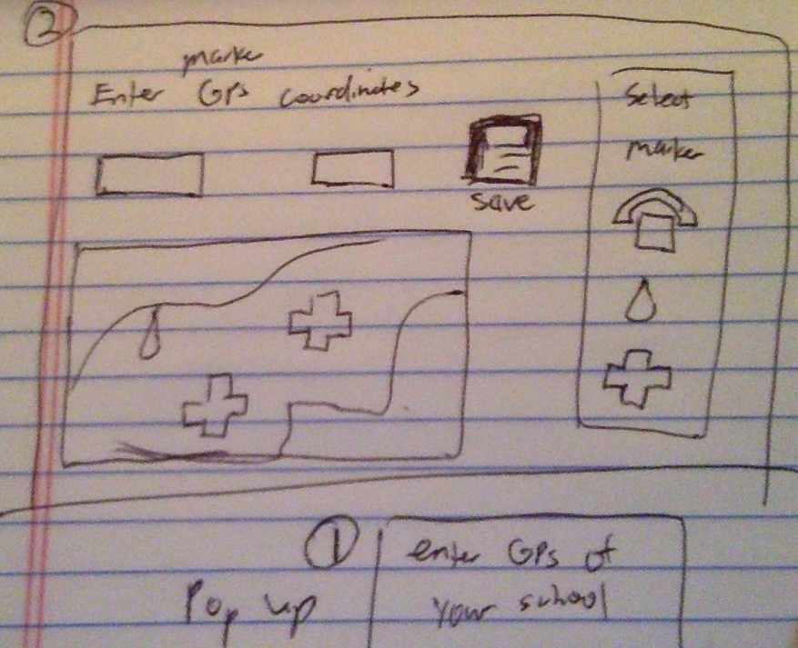
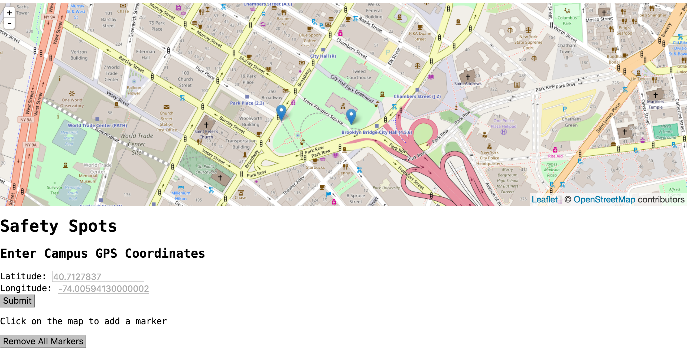

# cfaCampus-Safety
A project for Code for Atlanta: Safety Spots





##My Milestones to reach
* Get a sample Leaflet map to work
* Understand how Leaflet markers work, replace them with a library of safety icons (phones, waterbooths for marathons, etc.)
* Create frontend that allows for people to enter GPS coordinates and make markers based on CRUD functionalities
* If there's lots of time left, make a login at the request of Code for Atlanta (but really, a service like this shouldn't need a login IMHO)


##Obstacles
## 1. Binding input fields to Controller using Angular
Got really close to polishing up an MVP. Right now, it has school GPS coordinates hardcoded and ability to make markers. However, I had a tough time understanding how "angular.extend" works. Little googling brought me to a good example. Let's consider the following transformation:

Traditionally, how to write a function for ng-click would looke like this if modifying an object:

```js
app.controller(‘ThingController’, [ ‘$scope’, function($scope) {
   $scope.thingOne = ‘one’;
   $scope.thingTwo = ‘two’;
   $scope.getThings = function() { 
       return $scope.thingOne + ‘ ‘ + $scope.thingTwo; 
   };
}]);
```
With angular.extend it'll look like this:

```js
app.controller(‘ThingController’, [ ‘$scope’, function($scope) {
    angular.extend($scope, {
        thingOne: ‘one’,
        thingTwo: ‘two’,
        getThings: function() { 
            return $scope.thingOne + ‘ ‘ + $scope.thingTwo; 
        }
    });
}]);
```

Examples courtesty of here: [http://moduscreate.com/angularjs-tricks-with-angular-extend/](http://moduscreate.com/angularjs-tricks-with-angular-extend/)

However, even with that implementation, there's still something fishy happening with how my input values are being bound to the function. I'm seeing error messages with "[AngularJS - Leaflet]  invalid 'center' " ...getting closer.

## Possibly converting whole project to ReactJS
I've made the quintessential todo app using React. I'm pretty confident on converting my logic into components but not sure how it'll work once I incoporate NodeJS for the backend. With regards to earlier issues like the input fields, I ended up refactoring them into vanilla Javascript. More details on that later.

###Side notes and Resources:
Found nifty plugin to adding 'search' for map [here](https://github.com/smeijer/L.GeoSearch)

How to [make custom icon markers](http://leafletjs.com/examples/custom-icons/)

This [fiddle](http://jsfiddle.net/kedar2a/5VLJU/8/) helped me understand how to make markers without the use of scopes

Thanks http://www.gps-coordinates.net/ for the [GPS Coordinates](http://www.gps-coordinates.net/)
